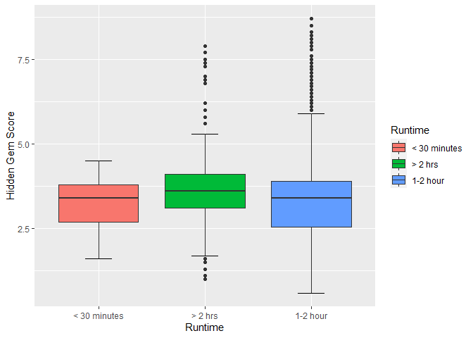
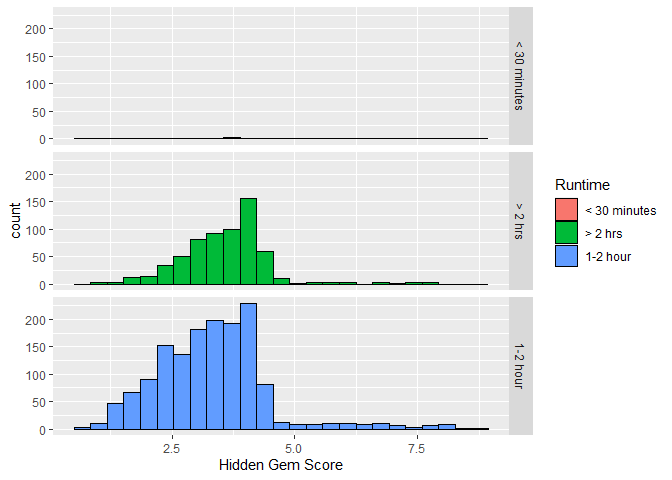
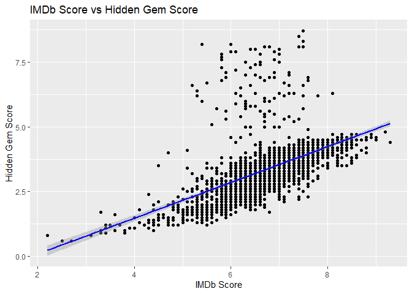
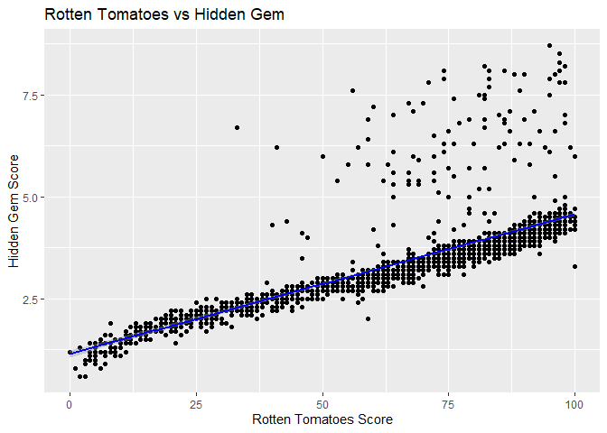
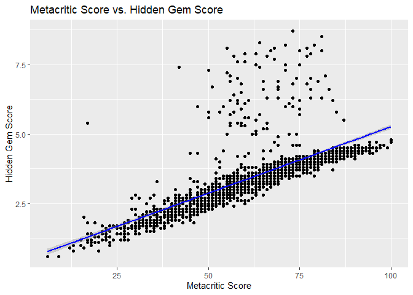
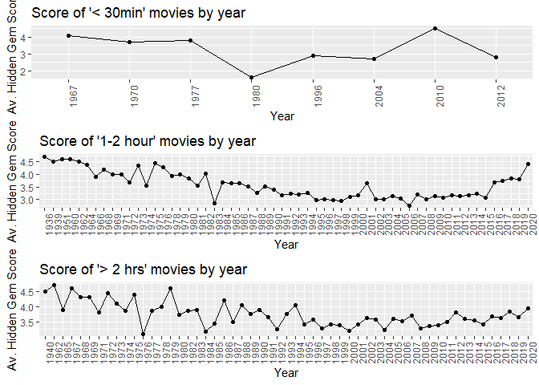

Data Cleaning and Visialization
================

## Data Cleaning

``` r
setwd('C:/Users/admin/Documents/R Data Analysis')
#raw data set
project_data = read_csv("Final_Project_FlixGem.csv")
```

    ## Rows: 9425 Columns: 29

    ## -- Column specification --------------------------------------------------------
    ## Delimiter: ","
    ## chr  (19): Title, Genre, Tags, Languages, Series or Movie, Country Availabil...
    ## dbl   (8): Hidden Gem Score, IMDb Score, Rotten Tomatoes Score, Metacritic S...
    ## dttm  (2): Release Date, Netflix Release Date

    ## 
    ## i Use `spec()` to retrieve the full column specification for this data.
    ## i Specify the column types or set `show_col_types = FALSE` to quiet this message.

``` r
project_data
```

    ## # A tibble: 9,425 x 29
    ##    Title    Genre     Tags         Languages   `Series or Movi~ `Hidden Gem Sco~
    ##    <chr>    <chr>     <chr>        <chr>       <chr>                       <dbl>
    ##  1 Lets Fi~ Crime, D~ Comedy Prog~ Swedish, S~ Series                        4.3
    ##  2 HOW TO ~ Comedy    Dramas,Come~ English     Movie                         7  
    ##  3 The Con~ Comedy, ~ Romantic Co~ Thai        Movie                         8.6
    ##  4 Gleboka~ Drama     TV Dramas,P~ Polish      Series                        8.7
    ##  5 Only a ~ Drama     Social Issu~ Swedish     Movie                         8.3
    ##  6 Snowrol~ Comedy    Sports Movi~ Swedish, E~ Movie                         5.3
    ##  7 The Inv~ Crime, D~ Thriller Mo~ English     Movie                         2  
    ##  8 The Sim~ Drama     Social Issu~ Scanian, S~ Movie                         7.8
    ##  9 To Kill~ Short, D~ Dramas,Swed~ Spanish     Movie                         8.8
    ## 10 Joker    Crime, D~ Dark Comedi~ English     Movie                         3.5
    ## # ... with 9,415 more rows, and 23 more variables: Country Availability <chr>,
    ## #   Runtime <chr>, Director <chr>, Writer <chr>, Actors <chr>,
    ## #   View Rating <chr>, IMDb Score <dbl>, Rotten Tomatoes Score <dbl>,
    ## #   Metacritic Score <dbl>, Awards Received <dbl>, Awards Nominated For <dbl>,
    ## #   Boxoffice <dbl>, Release Date <dttm>, Netflix Release Date <dttm>,
    ## #   Production House <chr>, Netflix Link <chr>, IMDb Link <chr>, Summary <chr>,
    ## #   IMDb Votes <dbl>, Image <chr>, Poster <chr>, TMDb Trailer <chr>, ...

``` r
#cleaned data without missing values and series columns
q1_cleaned_data = project_data %>% drop_na() 
q1_cleaned_data = filter(q1_cleaned_data, q1_cleaned_data$`Series or Movie`=="Movie")
q1_cleaned_data
```

    ## # A tibble: 2,118 x 29
    ##    Title                 Genre Tags  Languages `Series or Movi~ `Hidden Gem Sco~
    ##    <chr>                 <chr> <chr> <chr>     <chr>                       <dbl>
    ##  1 Joker                 Crim~ Dark~ English   Movie                         3.5
    ##  2 I                     Acti~ Dram~ English,~ Movie                         2.8
    ##  3 Harrys Daughters      Adve~ Dram~ English   Movie                         4.4
    ##  4 The Closet            Come~ Kore~ French    Movie                         3.8
    ##  5 Ordinary People       Drama Kore~ English   Movie                         4.2
    ##  6 Stand by Me           Adve~ Kore~ English   Movie                         4.1
    ##  7 Wonderstruck          Adve~ Chil~ English,~ Movie                         3.6
    ##  8 The Girl on the Train Crim~ Boll~ English,~ Movie                         2.6
    ##  9 Red                   Acti~ Dram~ English,~ Movie                         3.4
    ## 10 Burden                Drama Movi~ English   Movie                         7.8
    ## # ... with 2,108 more rows, and 23 more variables: Country Availability <chr>,
    ## #   Runtime <chr>, Director <chr>, Writer <chr>, Actors <chr>,
    ## #   View Rating <chr>, IMDb Score <dbl>, Rotten Tomatoes Score <dbl>,
    ## #   Metacritic Score <dbl>, Awards Received <dbl>, Awards Nominated For <dbl>,
    ## #   Boxoffice <dbl>, Release Date <dttm>, Netflix Release Date <dttm>,
    ## #   Production House <chr>, Netflix Link <chr>, IMDb Link <chr>, Summary <chr>,
    ## #   IMDb Votes <dbl>, Image <chr>, Poster <chr>, TMDb Trailer <chr>, ...

## PART A

# Runtime and Hidden Gem Score Association

The distributions are similar in terms of their central location,
spread, and skewness. The median, which shows the midpoint of the data,
has almost the same value.

Thus, there is no association between the Runtime length and Hidden Gem
Score.

Box Plots

``` r
#find a correlation between hidden gem score and the runtime and languages
ggplot(q1_cleaned_data,aes(x=`Runtime`,y=`Hidden Gem Score`, fill=`Runtime`)) + stat_boxplot(geom="errorbar",width=0.25) + geom_boxplot() + ylab("Hidden Gem Score")
```

<!-- -->

Histograms

``` r
ggplot(q1_cleaned_data, aes(x=`Hidden Gem Score`,group=`Runtime`,fill=`Runtime`)) + geom_histogram(bins=25,col="black") + facet_grid(rows=vars(`Runtime`))
```

<!-- -->

## PART B

Correlation specifically refers to the degree to which variables are
linearly correlated.

Based on the scatter plots, we can see that all three distributions have
a positive correlation. All three distributions have a positive linear
association since as one of the x-variables increases (all of IMDB,
Rotten Tomatoes, Metacritic Score), so does the y-value - Hidden Gem
Score.

Based on the correlation table, the strongest linear relationship is
displayed by Rotten Tomatoes Score and Hidden Gem Score (0.789). The
less strong, but still strong linear association, is illustrated by
Metacritic Score and Hidden Gem Score (0.74). The relationship with the
lowest degree of correlation is IMDb Score and Hidden Gem Score (0.57).

Scatter plot with line

``` r
#determine correlation between IMDb, Rotten Tomatoes, MetaCritic and the Hiden Gem SCore
ggplot(q1_cleaned_data,aes(x=`IMDb Score`,y=`Hidden Gem Score`)) + geom_point()  + labs(x="IMDb Score", y="Hidden Gem Score", title="IMDb Score vs Hidden Gem Score") + theme(legend.position = "none") + geom_smooth(method="lm",col="blue")
```

    ## `geom_smooth()` using formula 'y ~ x'

<!-- -->

``` r
ggplot(q1_cleaned_data,aes(x=`Rotten Tomatoes Score`,y=`Hidden Gem Score`)) + geom_point()  + labs(x="Rotten Tomatoes Score", y="Hidden Gem Score", title="Rotten Tomatoes vs Hidden Gem") + theme(legend.position = "none") + geom_smooth(method="lm",col="blue")
```

    ## `geom_smooth()` using formula 'y ~ x'

<!-- -->

``` r
ggplot(q1_cleaned_data,aes(x=`Metacritic Score`,y=`Hidden Gem Score`)) + geom_point()  + labs(x="Metacritic Score", y="Hidden Gem Score", title="Metacritic Score vs. Hidden Gem Score") + theme(legend.position = "none") + geom_smooth(method="lm",col="blue")
```

    ## `geom_smooth()` using formula 'y ~ x'

<!-- -->

Correlation table

``` r
q1_cleaned_data %>% summarise("IMDb and Hidden Gem Score" = cor(`IMDb Score`,`Hidden Gem Score`), "Rotten Tomatoes Score and Hidden Gem Score" = cor(`Hidden Gem Score`,`Rotten Tomatoes Score`), "Metacritic Score & Hidden Gem Score" = cor(`Hidden Gem Score`,`Metacritic Score`)) %>% pivot_longer(cols=c(ends_with( "Hidden Gem Score" )), names_to="Relationship between" )
```

    ## # A tibble: 3 x 2
    ##   `Relationship between`                     value
    ##   <chr>                                      <dbl>
    ## 1 IMDb and Hidden Gem Score                  0.574
    ## 2 Rotten Tomatoes Score and Hidden Gem Score 0.789
    ## 3 Metacritic Score & Hidden Gem Score        0.741

# PART C

Since the database considers the data from 1930x to 2020, it is more
appropriate to plot the Hidden Gem Score by category of RunTime Length
over years. If we use monthly or even daily measures, it will be harder
to interpret the results.

There is a slight increase in the Hidden Gem Score over the last few
years. However, there is no clear evidence in the trend that people are
more accepting of longer movies. The increasing trend over the last few
years will continue since from 1998 the Hidden Gem Score was changing
around 3.5. Based on the observations, there is no evidence that the
Hidden Gem Score for longer movies (> 2 hours) is going to increase.

``` r
bydate = q1_cleaned_data %>% mutate(Year=format(q1_cleaned_data$`Release Date`, format="%Y"))

min30=filter(bydate, grepl("< 30 minutes", q1_cleaned_data$Runtime, fixed=TRUE))
min60=filter(bydate, grepl("1-2 hour", q1_cleaned_data$Runtime, fixed=TRUE))
min120=filter(bydate, grepl("> 2 hrs", q1_cleaned_data$Runtime, fixed=TRUE))

by_min30 = min30 %>% group_by(Year) %>% summarise(`Average Hidden Gem Score`=mean(`Hidden Gem Score`))
by_min60 = min60 %>% group_by(Year) %>% summarise(`Average Hidden Gem Score`=mean(`Hidden Gem Score`))
by_min120 = min120 %>% group_by(Year)%>% summarise(`Average Hidden Gem Score`=mean(`Hidden Gem Score`))

min30plot=ggplot(by_min30,aes(x=Year,y=`Average Hidden Gem Score`,group=1)) +
     geom_point() + geom_line() +
    theme(axis.text.x = element_text(angle = 90)) +
    labs(x="Year",y="Av. Hidden Gem Score",title="Score of '< 30min' movies by year") 
 
min60plot =  ggplot(by_min60,aes(x=Year,y=`Average Hidden Gem Score`,group=1)) +
 geom_point() + geom_line() +
 theme(axis.text.x = element_text(angle = 90)) +
 labs(x="Year",y="Av. Hidden Gem Score",title="Score of '1-2 hour' movies by year") 
 
min120plot =  ggplot(by_min120,aes(x=Year,y=`Average Hidden Gem Score`,group=1)) +
 geom_point() + geom_line() +
 theme(axis.text.x = element_text(angle = 90)) +
 labs(x="Year",y="Av. Hidden Gem Score",title="Score of '> 2 hrs' movies by year") 
 
grid.arrange(min30plot, min60plot, min120plot, ncol=1)
```

<!-- -->
