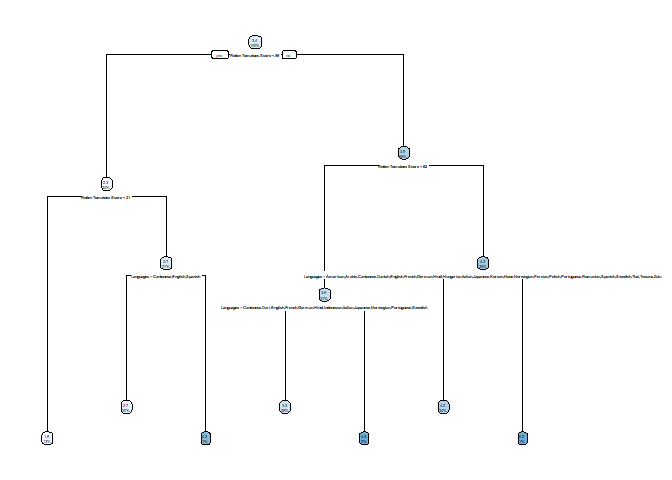

random Forest
================

# The model’s most important features:

The chosen factors by the model at which tree splits are the most
important predictors. The Rotten Tomatoes Score is the most important
factor since the tree splits at Rotten Tomatoes Score 3 times and this
factor is at the root of the tree.

``` r
setwd('C:/Users/admin/Documents/R Data Analysis')
project_data = read_csv("Final_Project_FlixGem.csv")
```

    ## Rows: 9425 Columns: 29

    ## -- Column specification --------------------------------------------------------
    ## Delimiter: ","
    ## chr  (19): Title, Genre, Tags, Languages, Series or Movie, Country Availabil...
    ## dbl   (8): Hidden Gem Score, IMDb Score, Rotten Tomatoes Score, Metacritic S...
    ## dttm  (2): Release Date, Netflix Release Date

    ## 
    ## i Use `spec()` to retrieve the full column specification for this data.
    ## i Specify the column types or set `show_col_types = FALSE` to quiet this message.

``` r
q1_cleaned_data = project_data %>% drop_na() 
q1_cleaned_data = filter(q1_cleaned_data, q1_cleaned_data$`Series or Movie`=="Movie")

#The data further cleaned:
#Languages: first language appereared in the string, is the original language. This is the language that we consider for our dataset
#Runtime: for rpart, it is better to recode Runtime variable: "<30min" as numeric 30, 1-2hour as numeric 60, and >2 hrs as numeric 120

recoded = q1_cleaned_data
recoded$Languages=str_extract(recoded$Languages,"(\\w+)")
recoded$Runtime=as.numeric(recode(recoded$Runtime, "> 2 hrs"="120", "< 30 minutes"="30", "1-2 hour"="60"))

# Create training (70%) and test (30%) sets for the AmesHousing::make_ames() data.
# Use set.seed for reproducibility
set.seed(123)
split <- initial_split(recoded, prop = .7)
train <- training(split)
test  <- testing(split)


m1 <- rpart(
     formula = `Hidden Gem Score` ~  `Languages` + `Runtime` + `IMDb Score` + `Rotten Tomatoes Score` + `Metacritic Score`,
      data    = train,
        method  = "anova")
m1
```

    ## n= 1482 
    ## 
    ## node), split, n, deviance, yval
    ##       * denotes terminal node
    ## 
    ##  1) root 1482 1766.47000 3.396289  
    ##    2) Rotten Tomatoes Score< 58.5 503  214.44910 2.345924  
    ##      4) Rotten Tomatoes Score< 30.5 193   25.65119 1.779793 *
    ##      5) Rotten Tomatoes Score>=30.5 310   88.42919 2.698387  
    ##       10) Languages=Cantonese,English,Spanish 302   36.56755 2.654967 *
    ##       11) Languages=French,German,Greek,Korean,Mandarin,Zulu 8   29.79875 4.337500 *
    ##    3) Rotten Tomatoes Score>=58.5 979  711.95440 3.935955  
    ##      6) Rotten Tomatoes Score< 81.5 459  263.97560 3.579956  
    ##       12) Languages=Cantonese,Dari,English,French,German,Hindi,Indonesian,Italian,Japanese,Norwegian,Portuguese,Swedish 435  197.88900 3.527586 *
    ##       13) Languages=Czech,Danish,Dutch,Korean,Mandarin,Maori,Spanish 24   43.26958 4.529167 *
    ##      7) Rotten Tomatoes Score>=81.5 520  338.46000 4.250192  
    ##       14) Languages=American,Arabic,Cantonese,Danish,English,French,German,Hindi,Hungarian,Italian,Japanese,Korean,None,Norwegian,Persian,Polish,Portuguese,Romanian,Spanish,Swedish,Thai,Tswana,Zulu 510  273.92170 4.211569 *
    ##       15) Languages=Czech,Filipino,Indonesian,Mandarin 10   24.97600 6.220000 *

``` r
m2 <- rpart(
     formula = `Hidden Gem Score` ~  `Languages` + `Runtime` + `IMDb Score` + `Rotten Tomatoes Score` + `Metacritic Score`,
      data    = test,
        method  = "anova")

rpart.plot(m1)
```

<!-- -->

# The model’s performance

R-squared is a measure of the proportion of the variance for the
depedent variable (Hidden Gem Score) that is explained by indepedent
variables (the predictors). Based on the train data, 64.21% of variance
of Hidden Gem Score can be explained by the variance of chosen factors
(2 factors in the tree).

Root Mean Square Error is the standard deviation of the residuals. RMSE
of the trained data is 65.3%.

``` r
# Function that finds RMSE and R sq

evaluation = function (actual, predicted, df) {
  sse = sum((predicted - actual)^2)
  sst = sum((actual - mean(actual))^2)
  rsq = 1 - sse/sst
  rmse = sqrt(sse/nrow(df))
  #output a data frame with RMSE and R sq
  data.frame(
    RMSE = rmse,
    Rsquare = rsq
  )
}

# Evaluate the model on train data

predict_train = predict(m1, data=train)
evaluation(train$`Hidden Gem Score`, predict_train, train)
```

    ##        RMSE   Rsquare
    ## 1 0.6530701 0.6421825

Also, it is helpful to use the measures of accuracy prediction of our
forecasting method. Three measures that were chosen to measure the
accuracy are relative error, cross-validated error and absolute-mean
error.

``` r
model_error=printcp(m1)
```

    ## 
    ## Regression tree:
    ## rpart(formula = `Hidden Gem Score` ~ Languages + Runtime + `IMDb Score` + 
    ##     `Rotten Tomatoes Score` + `Metacritic Score`, data = train, 
    ##     method = "anova")
    ## 
    ## Variables actually used in tree construction:
    ## [1] Languages             Rotten Tomatoes Score
    ## 
    ## Root node error: 1766.5/1482 = 1.1919
    ## 
    ## n= 1482 
    ## 
    ##         CP nsplit rel error  xerror     xstd
    ## 1 0.475562      0   1.00000 1.00130 0.059994
    ## 2 0.061999      1   0.52444 0.53474 0.049178
    ## 3 0.056819      2   0.46244 0.47412 0.047828
    ## 4 0.022396      3   0.40562 0.41377 0.045517
    ## 5 0.012917      4   0.38322 0.42252 0.045645
    ## 6 0.012490      5   0.37031 0.43139 0.045660
    ## 7 0.010000      6   0.35782 0.43295 0.045522

Taking as an example, line number 8 (nsplit=7):

The relative error of 0.348 shows that model is incorrect 34.8% of the
time. The relative error is the measure of precision, a ratio at which
the model is wrong on predicting the sample on which it was trained. The
‘xerror’ is the cross-validation error, which shows the accuracy of the
model, on which it was not trained. When xerror = 0.438, the model’s
error on predicting the Hidden Gem Score on the new data is 43.8%.

Even though the model is not perfect, it still holds a predictive value.

Moreover, we can measure the average deviation from the actual gem
score. It is a measure of error between predicted and observed Hidden
Gem Scores. The mean absolute error of 0.3455 shows that model is
correct most of times on the sample, on which it was trained.

``` r
mae(m1)
```

    ## [1] 0.3588911

Even though this model is not perfect, it holds a predictive value since
it’s correct most of the times on the sample it was trained on. The R-sq
is 64.21%, which suggest that 64.21% of variance of Hidden Gem Score can
be explained by the variance of chosen factors. However, the RMSE is
65%, which suggests that the model can be tuned and improved to make min
errors lesser.
